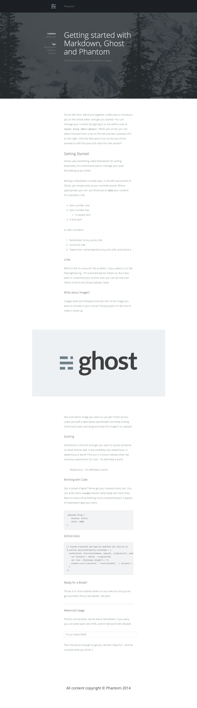

# Phantom

A minimalistic theme for [Ghost](https://ghost.org/) inspired by the [Designmodo Journal](http://journal.designmodo.com/). Phantom combines clean, beautiful typography with large cover photos and an unobtrusive layout. Great for both print and code. Oh, and it's free. Check out a demo [here](http://haydenbleasel.com/phantom/).

## Features

As Ghost is and always will be in development, Phantom will evolve with it. As new features and concepts are implemented in Ghost, Phantom will adapt and enhance to suit these new features. If you have any problems or feature requests, feel free to open an issue or submit a pull request (development branch please).

- **Cover Photos:** Large background cover photos covered by a dark, transparent wash allow for overlaying text.
- **Efficient CSS:** The stylesheets are built with LESS for scalable, efficient development. Easy to modify, too!
- **Responsive Design:** Phantom was designed and developed with a fully responsive, mobile-first design.
- **Code Support:** Want to insert a Markdown `code block` or embed a GitHub Gist? Phantom has both covered.
- **Comment System:** Adding a Disqus commenting system to your blog has never been easier.
- **Custom Fonts:** Phantom uses 'Open Sans' served be Google Web Fonts.
- **Social Sharing:** Each post is set up with Facebook, Twitter and Google+ social sharing options.
- **Ghost Features:** Tags, dates, partials and all the helpful Ghost features have been preconfigured.

## Installation

1. [Download the theme](https://github.com/haydenbleasel/phantom/archive/master.zip) from GitHub.
2. Upload the theme as described in the [Ghost Documentation](http://docs.ghost.org/usage/settings/).

Looking for more instructions? Sorry, it's just that easy.

## Enabling Disqus Comments

If you want to enable comments, simply open `post.hbs` and remove the exclamation mark in the comments block, so `{{!> comments}}` becomes `{{> comments}}`.

You'll also need to enter your Disqus "shortname". Just head on over to the [Disqus](http://disqus.com/) website and register for an account. They'll give you a small snippet of code, but all we need from it is the following line: `var disqus_shortname = 'YOUR_SHORTNAME_HERE';`

Once you have that, just open `partials/comments.hbs` and replace the `YOUR_SHORTNAME_HERE` variable with the one Disqus gave you. Try not to edit any other settings or replace the code though, it's preconfigured to work with Ghost.

## Screenshot

## Copyright and License

Copyright (C) 2014 Hayden Bleasel - Released under the MIT License.

Permission is hereby granted, free of charge, to any person obtaining a copy of this software and associated documentation files (the "Software"), to deal in the Software without restriction, including without limitation the rights to use, copy, modify, merge, publish, distribute, sublicense, and/or sell copies of the Software, and to permit persons to whom the Software is furnished to do so, subject to the following conditions:

The above copyright notice and this permission notice shall be included in all copies or substantial portions of the Software.

THE SOFTWARE IS PROVIDED "AS IS", WITHOUT WARRANTY OF ANY KIND, EXPRESS OR IMPLIED, INCLUDING BUT NOT LIMITED TO THE WARRANTIES OF MERCHANTABILITY, FITNESS FOR A PARTICULAR PURPOSE AND NONINFRINGEMENT. IN NO EVENT SHALL THE AUTHORS OR COPYRIGHT HOLDERS BE LIABLE FOR ANY CLAIM, DAMAGES OR OTHER LIABILITY, WHETHER IN AN ACTION OF CONTRACT, TORT OR OTHERWISE, ARISING FROM, OUT OF OR IN CONNECTION WITH THE SOFTWARE OR THE USE OR OTHER DEALINGS IN THE SOFTWARE.